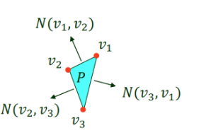
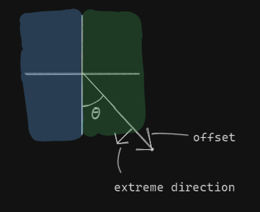

CMPUT 403: Minkowski Sum

### Minkowski Sums

In general, the Minkowski sum of two sets of vectors, $A$ and $B$ is the set of vectors that result from adding each vector in $A$ to each vector in $B$. 

```
MS(A, B) = {a + b, for a in A, for b in B}
```

MS(A, B) denotes the Minkowski sum of A and B
CH(A) denotes the convex hull of A

### Properties of Minkowski Sums
- MS of convex polygons is convex
- CH(MS(A), MS(B)) is the same as MS(CH(A), CH(B))
  - computing the MS of two convex polygons is fast and CH is also fast, so this is useful 
- The number of vertices of the Minkowski Sum of convex polygons is bounded by the total number of vertices of the polygons
  - The exact number of vertices is the number of distinct angles across all edges
- Two convex polygons A and B intersect if MS(A, -B) contains (0, 0). -B is B but the coordinates are negated.  
- MS of anything with the empty set is the empty set

### Minkowski Sum for Two Finite Sets of Points
$A$ is a set of points of size N
$B$ is a set of points of size M

We can easily compute the Minkowski sum by adding each point in $A$ with each point in $B$ in $O(NM)$. 

We can visualize this by fixing the position of points in $A$ and for each point in $B$, imagine that it's a tip of a marker. We will move the origin of $B$ (along with all the points in $B$), to each point in $A$, and then draw a point where each marker now lies. 

### Minkowski Sum of Two Convex Polygons
Now $A$ and $B$ are convex polygons. Convex polygons are not a finite set of points, so we need a different approach. 

The Minkowski sum of two convex polygons will be convex, and we will only need to consider the vertices of our two polygons to compute the vertices of their Minkowski sum. 

Knowing this we can brute force each pair of vertices from $A$ and $B$, adding them together, and then take the convex hull of it to find the convex polygon that results from their Minkowski sum. 

This gives us a $O(nm\log(nm))$ solution, where $n$ is the number of vertices in $A$ and $m$ is the number of vertices in $B$, but we can do better.

We will directly compute the convex hull of MS(A, B). 

The minimum point $(x, y)$ of a set of points will be the leftmost point (smallest x). If there are multiple leftmost points, we choose the lowest (smallest y). 

If we consider the minimum point from A, $a_{min}$ and the minimum point from B, $b_{min}$, 
we know that $a_{min} + b_{min}$ will be the minimum point of MS(A, B), and that this point must lie on its convex hull. 

Similarly, if we find the rightmost point and tiebreak by choosing the highest for $A$ and $B$, we can find another pair of points whose sum must lie on the convex hull. 

Notice that we can keep choosing an arbitrary direction and then finding two points that are most extreme in that direction to build a piece of the hull. If we did this for every direction we would have the hull. 
](image-3.png)
https://faculty.sites.iastate.edu/jia/files/inline-files/15.%20Minkowski%20sum.pdf

A vertex is extreme between the directions that are normal to its edges. 

This means we would only need to consider the pairs of points that are extreme for directions from both polygons.  

Idea:
Start at the minimum point of both polygons. The current direction we are considering is $(-1, 0)$. Go to the next direction in CCW. If this direction is from polygon $A$, then update $A$'s point. If this direction is from polygon $B$, then update $B$'s point. 

offset:
```
for an edge a -> b of a polygon in CCW order, the offset is b - a.
```
Since each direction is normal to an edge, we can decide what the next direction is and what point to update by comparing offsets of the next edge of $A$ with the offset of the next edge of $B$. 

##### Algorithm:
$p$ starts at the min point of $A$. 
$q$ starts at the min point of $B$.

append $p + q$ to our answer.

If the next offset of $A$, $p_{nxt} - p$ is CCW to the next offset of $B$, $q_{nxt} - q$ then advance $q$ to $q_{nxt}$. 
Otherwise advance $p$ to $p_{nxt}$. 

Keep doing this until you reach the last point of both polygons. 

This runs in $O(n + m)$ time. 


#### Why it is Convex
My intuition for why it's convex is fixing the position of $A$, and imagining that $B$'s entire shape is a marker. Consider moving the origin of $B$ across the edges of $A$. For a straight line, the image that $B$ draws is just a stretched out version of its shape, so the image is convex. When there is a change in angle, this results in a shape with one concave angle. However, because $A$ is convex, these concave angles are on the "inside" of our image, so they can ultimately be filled in when you move the origin to colour the inside of $A$. 

#### Why only considering vertices is enough
We can think about the markers and the fact drawing along a straight line is the same as drawing straight lines to connect the two shapes drawn on either end, so the vertices of MS(A, B) result from the summing the vertices of $A$ and the vertices of $B$. 

But I also came up with another idea. 

Let $S$ denote the MS of the vertices of $A$ and the vertices of $B$.
Let $M$ denote the MS of $A$ and $B$. 

The goal is to show that every point in $M$ can be represented as a convex combination of points in $S$.

Every point in a convex polygon can be represented as convex combination of three vertices. Consider an arbitrary point in $M$. 

$$
p=a + b = \alpha_1 A_1 + \alpha_2A_2 + \alpha_3A_3 + \beta_1B_1 + \beta_2B_2 + \beta_3B_3 
$$
Finding a solution:
Choose the smallest non-zero values of $\alpha$ and $\beta$ and the vertices associated with them $A_i, B_j$

Add $min(\alpha, \beta)(A_i + B_j)$ to the combination. Decrement the chosen coefficients by their min. 

When all coefficients are 0, you have $p$ as a convex combination of points from $S$.

I think this shows that the vertices of the Minkowski sum of $A$ and $B$ are a subset of the Minkowski sum of the vertices of $A$ and the vertices of $B$, so it is enough to just consider the MS of the vertices knowing that the result is convex. 


### Minkowski Sum of Multiple Convex Polygons
We can extend the two pointer idea above to $n$ polygons. 

Imagine $n$ pointers this time. We will start at the min point of each polygon. At each step we will advance the pointer whose next point changes our current direction the least CCW. After each change, we can find a new point on the convex hull of the Minkowski sum. 

If we think of about each pointer advancing as an event, then we can sort these events or use a priority queue to compute the result in $O(N\log(N))$, where $N$ is the total number of vertices of all the polygons. 

If our event is point $u$ advancing to point $v$, then the only change to the sum of all points we are at is $v - u$. The lets us leads us to a cleaner algorithm, where we first compute the offsets of all polygons.

#### Algorithm:
Compute the offsets of all polygons and put them in a list. 

Compute the sum of the min point of all polygons. This is the starting point. 

Sort the offsets by polar angle. 

Iterate over the offsets. Append the current point to the answer, then add the offset to the current point. 

This runs in $O(N\log(N))$ time. 


### Polar Angles
Since I defined the min point as the leftmost and then tiebreak by choosing the lowest. My polar angle for the offsets look like this with points on the negative y axis defined to come last (think of them as 360 degrees). 

Notice that this ordering of offsets leads to the correct ordering for the extreme directions as well. 

The green section includes the positive y-axis and the blue section includes the negative y-axis. To sort by increasing polar angle, every point in the green section should come before every point in the blue section. Within each section use cross product to determine the ordering. 

### Recognizing Minkowski Sum Problems
Usually the problem has points which add together and some sort of convexity that makes it enough to consider the convex hull of something to get the answer.  
- Choosing a point from each set of points and having to maximize the distance from the origin of the sum of your points. 
- Choosing a subset of points and having to maximize the distance from the origin of the sum of your subset of points.
- Maximizing the cost of a subset of things and the cost is a sum of squares. Try making each thing a point. 
- Having to consider the set of all points produced by adding/subtracting n points from each of the n convex polygons.  
